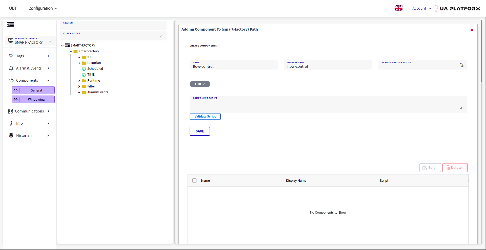
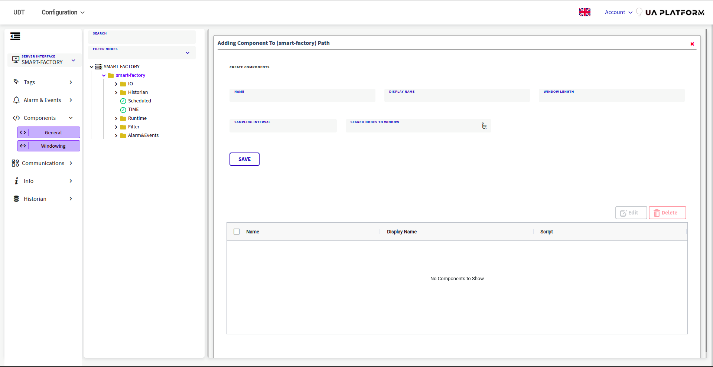

# Runtime Component

The Runtime Component is an important component in the platform that manages the execution of all the connected
components in the system. The key features of the Runtime Component are:

## Features

Event Management: The component allows to manage events and trigger them based on certain conditions and rules. The
events can be used to trigger notifications or actions in the system.

1. Data Collection and Management: The component enables the collection of data from various sources and stores it for
   analysis and reporting purposes. The data can be retrieved using the APIs provided by the component.

2. Write Data to OPC UA: The component allows to write data to an OPC UA server, enabling the integration with existing
   industrial automation systems.

3. Interoperability: The component allows the integration with different systems, protocols, and technologies through
   the support for various messaging systems such as Kafka, MQTT, RabbitMQ, and ActiveMQ.

4. Node Management: The component provides the capability to manage the nodes in the system and their configuration,
   enabling the customization of the system according to the requirements.

## Benefits for Industrial Processes

1. The Runtime Component provides a number of benefits for industrial processes, some of which are:

2. Real-time Monitoring: The component provides real-time monitoring of the system, enabling the identification of
   issues and potential areas for improvement.

3. Improved Decision Making: The data collected by the component can be used to make informed decisions, improving the
   overall efficiency of the process.

4. Increased Automation: The component enables the integration with existing automation systems, enabling the automation
   of tasks and increasing the efficiency of the process.

5. Enhanced Interoperability: The component provides interoperability with different systems, enabling the integration
   of disparate systems and improving the overall efficiency of the process.

6. Increased Flexibility: The component provides the ability to manage nodes and their configuration, enabling the
   customization of the system according to the requirements and increasing the flexibility of the process.

UDT platform provides two types of runtime components that can be used for various industrial processes: General
Component and Windowing Component.

## General Component

General Components are a type of runtime component that allows users to have their own script including specific
functionalities and libraries. This type of component can be used to execute custom logic, integrate with external
systems, perform data manipulation and processing, and much more.

Here are some benefits of using General Components:

1. Flexibility: General Components allow users to have full control over the logic and functionality of their component,
   enabling them to implement custom business logic as per their requirements.
2. Integration: General Components can be used to integrate with external systems, making it possible to perform tasks
   like data retrieval, data processing, and data storage.

3. Automation: General Components can be used to automate tasks, such as data processing and retrieval, making it
   possible to perform these tasks in real-time, without manual intervention.

- Go to Dashboard
- Choose a location in UDT
- Choose "Add General Component"
- Fill the required parameters

## Windowing Component

Windowing Components are a type of runtime component that allows users to choose specific nodes and observe their
changes over a specified duration. This type of component is useful for monitoring real-time data and detecting changes
in the system.

Here are some benefits of using Windowing Components:

1. Real-time monitoring: Windowing Components enable real-time monitoring of system data, making it possible to detect
   changes in the system and respond quickly.

2. Data Analysis: Windowing Components allow users to observe data changes over a specified duration, making it possible
   to perform data analysis and identify patterns in the system.

3. Automated Actions: Windowing Components can be used to trigger automated actions based on the data changes observed
   over the specified duration, enabling users to respond quickly to changes in the system.

4. Overall, the use of runtime components in the UDT platform offers a wide range of benefits for industrial processes,
   including improved efficiency, better data analysis, and real-time monitoring and response.

- Go to Dashboard
- Choose "Add Windowing Component"
- Fill the required parameters

## Interfaces
The Runtime Components Interfaces in Node4i platform allow communication and interaction with different components within the system. They provide a way for data to be exchanged, processed and acted upon in real-time. The main components include:

- [UaInterface](./Interfaces/UaInterface.md) 
  - This interface provides methods for accessing and interacting with OPC UA nodes and triggering events. It allows for reading and writing of values to the nodes, as well as sending messages to other systems such as Kafka, MQTT, RabbitMQ, and ActiveMQ.
- [AlarmEventInterface](./Interfaces/AlarmEventInterface.md)
  -  The AlarmEventInterface is a component in the Node4i system that is responsible for managing alarms and events within the platform.

## Real-Time Data Processing

Real-Time Data Processing refers to the ability to process and analyze data as it is generated or acquired, rather than
after it has been stored. It is a critical component in many industrial and business processes where quick and accurate
decision-making is essential.

In the context of Node4i's Runtime Components, real-time data processing involves the ability to perform real-time data
analysis and manipulation on data acquired from industrial devices and sensors. This includes the ability to process
large amounts of data in real-time, perform data filtering, aggregation, and transformation, and make decisions based on
the processed data.

The real-time data processing capabilities of Node4i's Runtime Components are critical for a variety of industrial
applications, including process control, predictive maintenance, and machine learning. These capabilities enable users
to make informed decisions based on real-time data, improve the efficiency and accuracy of industrial processes, and
reduce downtime and maintenance costs.

Node4i's Runtime Components are designed to be highly scalable and flexible, allowing users to easily process and
analyze large amounts of data in real-time. They also provide robust security features to ensure that sensitive data is
protected, and support a wide range of industrial protocols and data formats, making it easy to integrate with existing
industrial systems and devices.

Read More About [Real-Time Data Processing](./Real-Time-Data-Processiong/Real-time-Data-Processing.md)
